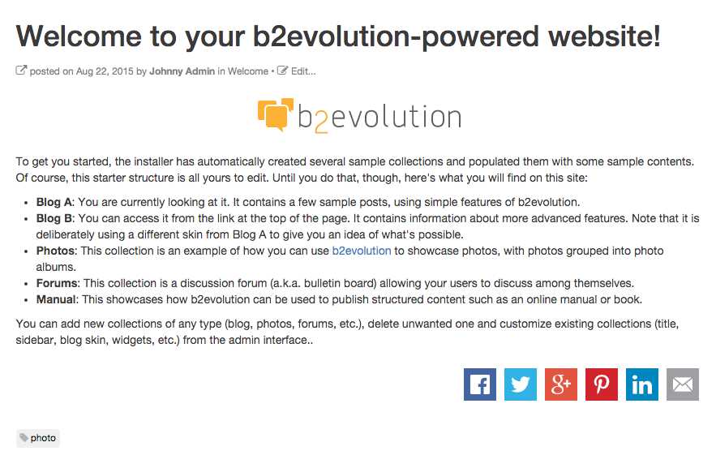
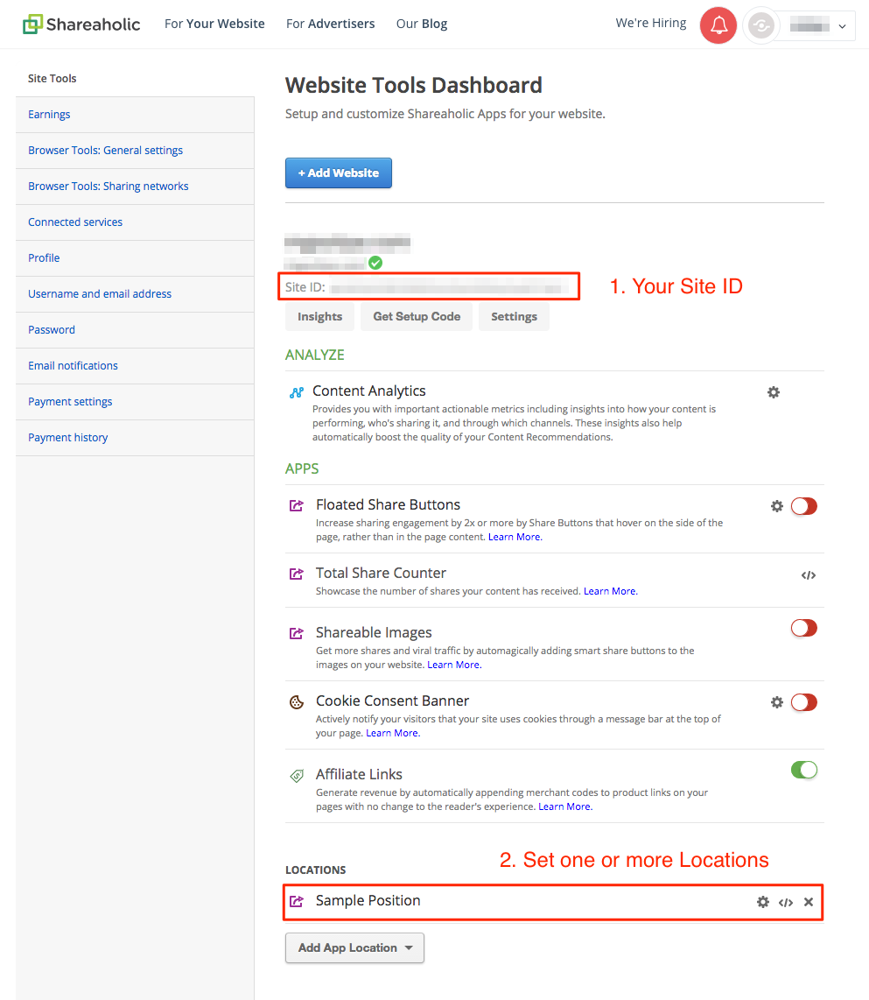
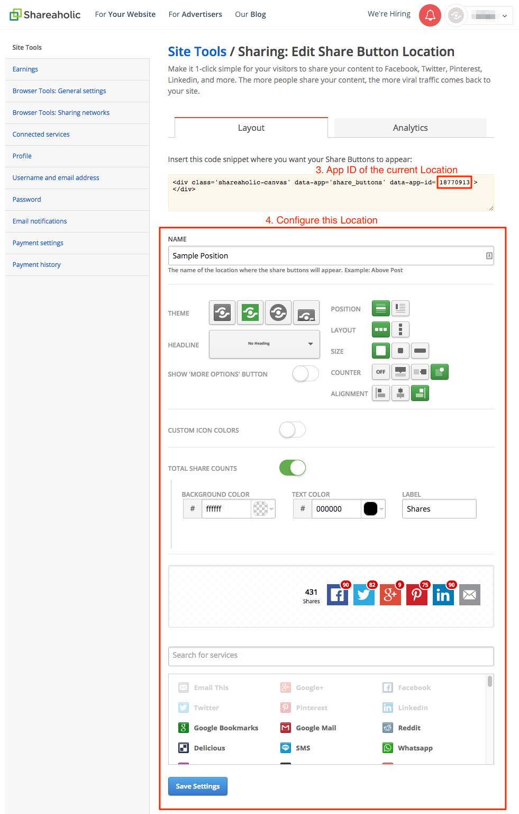
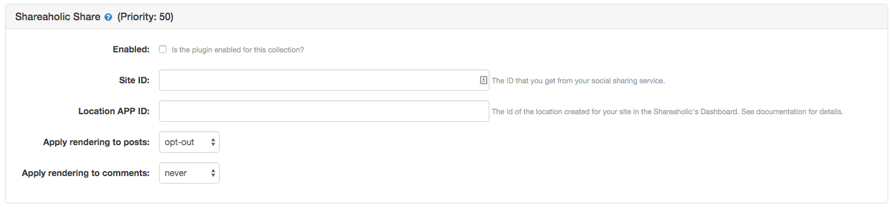
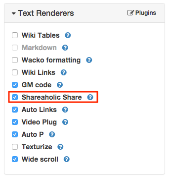

## Shareaholic plugin for b2evolution

Using this plugin you can display the Shareaholic sharing bar into the contents of your site and let your visitors share them to their preferred social networks and websites.

### Installation

You can use this plugin in your site by following the regular plugins installation process detailed in this manual page: [Plugins available for installation](http://b2evolution.net/man/plugins-available-for-installation).

1. Go to the [Shareaholic website](http://www.shareaholic.com/), register a new user account (if you have not done it yet) and login into the site.
2. Go to the **Website Dashboard** and add a new website. You will get a `Site ID`, a string of 32 alphadecimal characters. 
3. Scroll down into the **App Locations** section and add a new one, configuring the layout and services that you want to display in your site. You will get a `Location APP ID`. 
4. Go back to your b2evolution site and open the plugins settings page of the collection in which you want to display the Shareaholic widget: [Plugin Settings](http://b2evolution.net/man/blog-plugin-settings)
5. Enable the plugin for that collection and paste the `Site ID` and `Location APP ID`. 

As this is a **Text Renderer plugin**, you may control when to enable / disable it for individual posts by checking the **Shareaholic** option in the **Text Renderers** panel of the posts' edition form. 